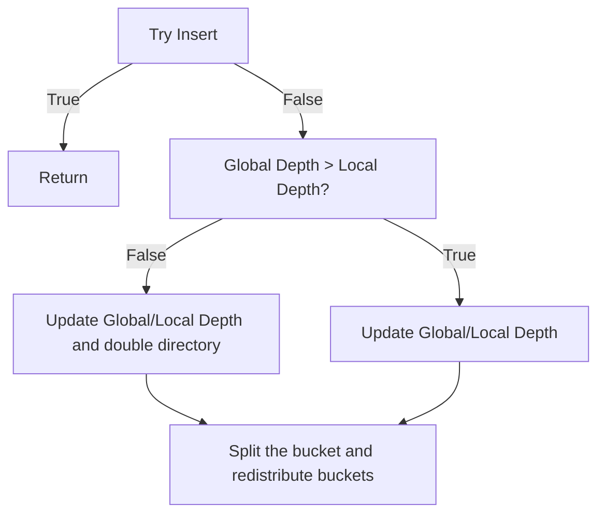

# Buffer Pool Manager

## Extendiable Hash Table
This [video](https://www.youtube.com/watch?v=r4GkXtH1la8) explains the insertion algorithm of EHT.

This projects doesn't require implementing shrinking after removing key-value pair from bucket. Thus, only insertion is tricky to implement.

The following is my understanding of EHT insertion algorithm

There are two questions:
1. After doubling directory, where should the new unallocated bucket pointer goes?
2. After splitting the bucket, how to redistribute new buckets

To answer the first question, look at the following example

To answer the second question, look at the following example
