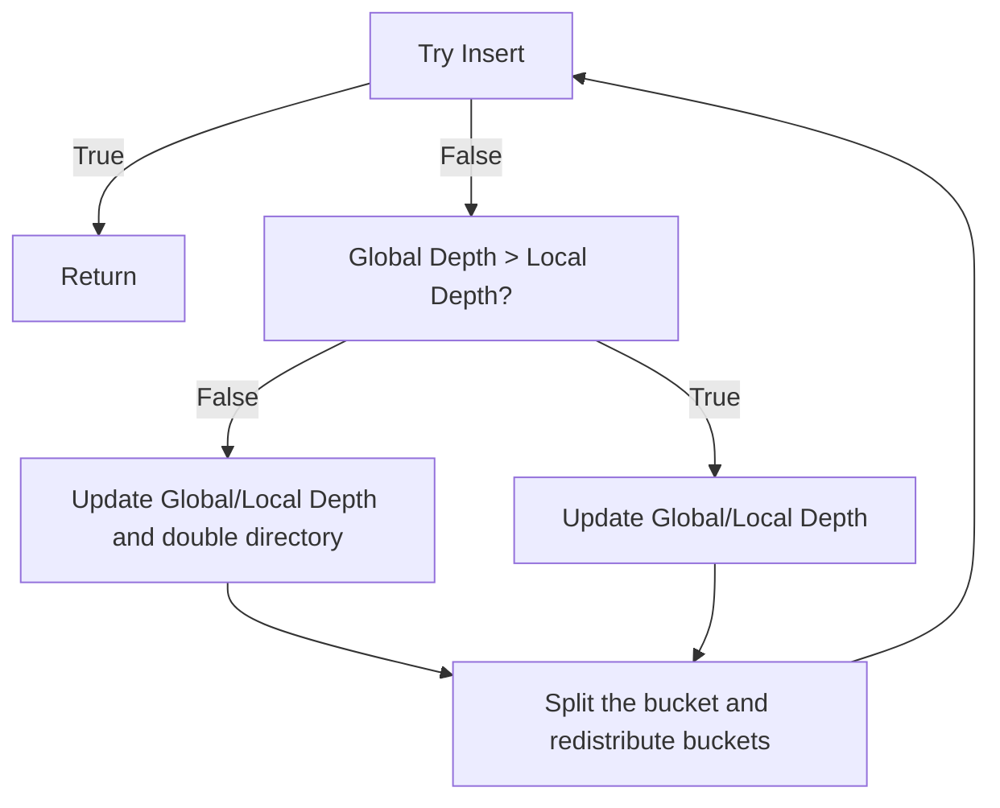
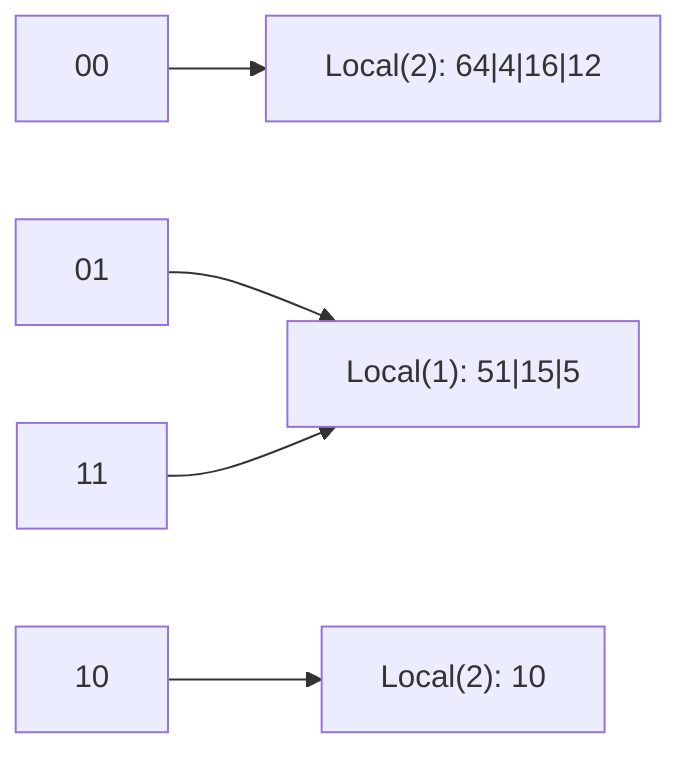
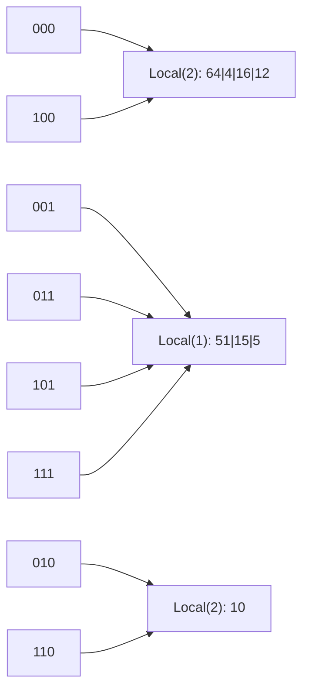
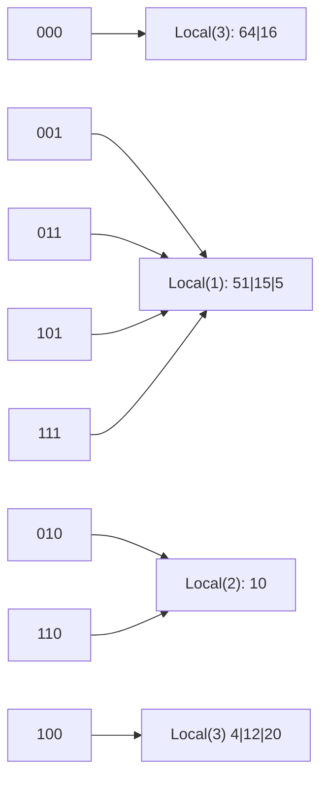

# Buffer Pool Manager

## [Extendiable Hash Table](https://en.wikipedia.org/wiki/Extendible_hashing)
This [video](https://www.youtube.com/watch?v=r4GkXtH1la8) explains the insertion algorithm of EHT.

This projects doesn't require implementing shrinking after removing key-value pair from bucket. Thus, only insertion is tricky to implement.

The following is my understanding of EHT insertion algorithm


There are two questions:
1. After doubling directory, where should the new unallocated bucket pointer goes?
2. After splitting the bucket, how to redistribute new buckets

To answer the first question, look at the an EHT example with bucket size of 4

Let's think about a directory with global path 2, which means the buckets will be group by 2 LSB of hash value. </br>


Notice that because the bucket that contains 51|15|5 has local path of 1, which means this bucket will only use 1 LSB to group data. So any directory whose hash value with its last bit equal to 1 should point to that bucket. And this rule also apply to n local path 

Now let's insert 20, the binary value of 20 is 101(**00**), so it should be inserted into the first bucket. But it's full now. So we need to split. And doubling the directory is required bufore splitting.


After doubling the directory, the global path will become 3 and there will be 4 more empty location inside directory.



The rule also apply here, all directory whose hash value with its local_path-th LSB are same should point to the same bucket. 

So how do we code this?
```
auto original_size = dir_.size();
dir_.resize(dir_.size() * 2);
dir_[index]->IncrementDepth();
for (int i = 0; i < static_cast<int>(original_size); i++) {
    dir_[original_size + i] = dir_[i];
}
```
Why dir_[original_size + i] = dir_[i]?

Let's look at the binary value by pair: </br>
000 100 </br>
001 101 </br>
010 110 </br>
011 111 </br>

it's clear to see that dir_[original_size + i] has the exact bit except for the right most one. </br>
And this answers the first question.</br>

To answer the second question, look at the above example again </br>
After creating a new empty bucket, we will loop the old bucket and use the updated local path to determine where the value should go. </br>
For example, the binary value of 20 is 10(**100**), then it should go to new bucket. 

The EHT will end up like this


One mistake I made is to check if the n-th bit of a value is 1.

For example, we want to check if 20 (10100)'s 4-th(start from 0) bit is 1 </br>
we can do
```
20 & (1 << 4) 
```
and we will get 16. </br>
However, I use if TestKBit(20, 4) == 1 to check, which break the whole program.

## LRU-K Cache

## Buffer Manager
