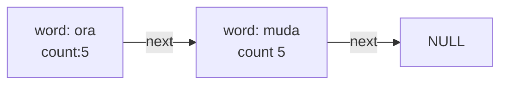
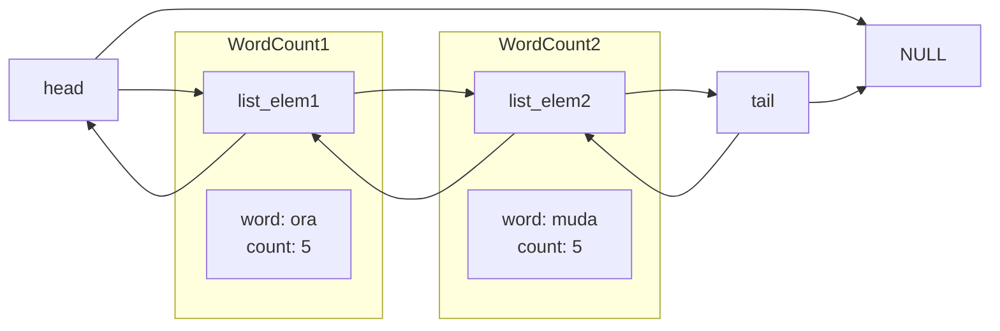

# Three versions of WordCount in HW0 and HW1

## WordCount Task Explain
WordCount is a simple task to calculate the frequency of words inside specified files or words from stdout

Program Usage
```
./words <file1> <file2> ...
./words < file
```
## WordCount1 (Traditional Linked List with Single Thread)
Single Linked list is used to implement WordCount </br>
Node
```
typedef struct word_count {
  char* word;
  int count;
  struct word_count* next;
} word_count_t;
```
Let's say we have the following conversation
</br>
ora ora ora ora ora </br>
muda muda muda muda muda </br>

The result should look like this

## WordCount2 (Pintos Linked List with Single Thread)

Pintos Linked list is different from traditional Linked list, the idea of Pintos list is inspired by [Linux Linked List](https://medium.com/@m.zanoosi/why-linux-kernel-doubly-linked-list-is-not-just-a-simple-linked-list-fb8c43ff150)</br>
Pintos list node<br>
```
struct list_elem {
  struct list_elem* prev; /* Previous list element. */
  struct list_elem* next; /* Next list element. */
};
```
Pintos list<br>
```
struct list {
  struct list_elem head; /* List head. */
  struct list_elem tail; /* List tail. */
};
```
The list node is seperated from specific struct like WordCount </br>

Therefore, to make WordCount a linked list, list_elem needs to be embed into WordCount
```
typedef struct word_count {
  char* word;
  int count;
  struct list_elem elem;
} word_count_t;
```

Look at the list result with above conversation

The logic to implement WordCount with Pintos list is same as traditional list</br>
The only difference between them is to use a provided macro **list_entry** to get actual WordCount instead of list_elem </br>
I'm confused about how the list_entry works 
```
#define list_entry(LIST_ELEM, STRUCT, MEMBER)                                                      \
  ((STRUCT*)((uint8_t*)&(LIST_ELEM)->next - offsetof(STRUCT, MEMBER.next)))

// Usage
struct list_elem* e = list_begin(wclist)
word_count_t* node = list_entry(e, word_count_t, elem);
```
The elem is inside struct definiton of word_count_t, then how can it be used outside without specify the word_count_t type?

## WordCount3 (Pintos Linked List with Multi-Thread)

The previous two implementation of WordCount both have only one threads to deal with multiple input files </br>
Now we are going to create one thread for each input file to speed up processing

Threads are single unique execution context with their own registers and stack, multiple threads share heap and global variables. </br>

For WordCount, each thread looks like this
```

word_count_list_t word_counts;


void* threadfunc(void* filename) {
  FILE* infile = fopen((char*)filename, "r");
  if (infile == NULL) {
      fprintf(stderr, "File not exists!\n");
      exit(-1);
  }
  printf("%s is being processed\n", (char*)filename);
  count_words(&word_counts, infile);
  fclose(infile);
  pthread_exit(NULL);
}
```
Each thread has its own assigned file (local variable), and all threads share one WordCount. </br>
The execution context of one thread is to open the assigned file and count how many words in that file. </br>
Since WordCount is a shared variable, a lock is needed to ensure correctness</br>
Therefore, the list node defined like this
```
#include <pthread.h>
typedef struct word_count_list {
  struct list lst;
  pthread_mutex_t lock;
} word_count_list_t;
```
the lock needs to be acquired before changing shared variable WordCount and needs to be released after changing WordCount