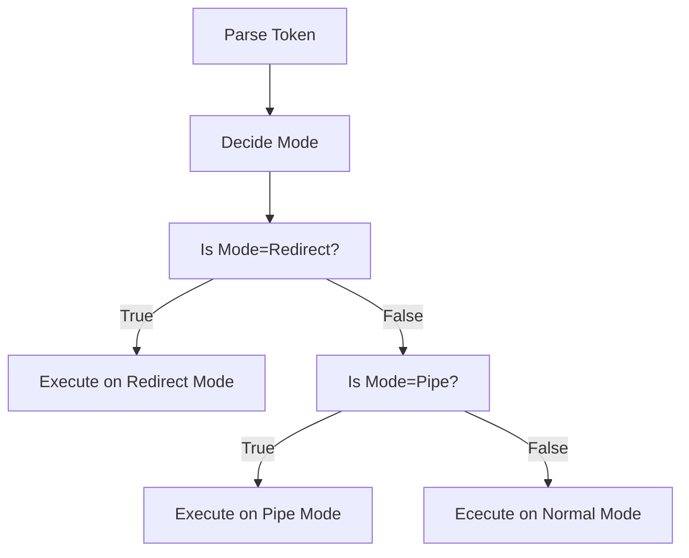

# Simple Shell

## Shell Task Explained
Implement a shell that supports 
1. Directory Commands: pwd, cd 
2. Program Execution with path resolution, redirection, pipes
3. Signal Handling
4. Foreground and Background processes

## First Try
Implementing Directory Commands is easy since the skeleton codes already provides an example of how to add new commands. </br>
However, I get stuck at implementing pipes because I try to put all Program Execution codes inside main function. Soon I mess up with the so many cases needed to be dealt with because of this bad programming habits. </br>

For Program Execution, there are many cases
```
1 ./prog # run program inside current working directory
2 /usr/bin/wc shell.c # run program outside of current working directory
3 wc shell.c # run program outside of current working directory with path resolution
4 wc < shell.c, wc shell.c > text.txt # run program with redirection
5 cat shell.c | grep "tokens" | wc # run program with pipes
```


Because this homework doesn't require complex execution like pipe with redirection, I group the program execution cases with 3 modes: 
1. Normal: any program execution commands without Redirect and Pipe
2. Redirect: program execution commands with > or <
3. Pipe: program execution commands with |

All three modes should support path resolution

## Pipe
Implementing pipe is the hardest task for this assignment.