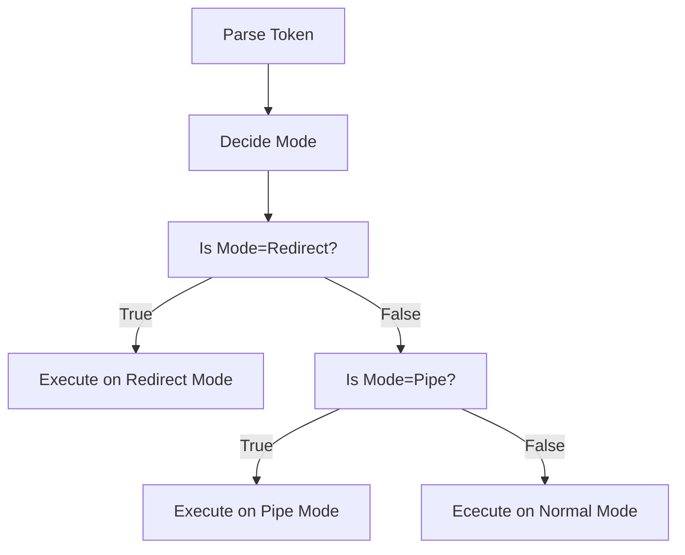

# Simple Shell

## Shell Task Explained
Implement a shell that supports 
1. Directory Commands: pwd, cd 
2. Program Execution with path resolution, redirection, pipes
3. Signal Handling
4. Foreground and Background processes

## First Try
Implementing Directory Commands is easy since the skeleton codes already provides an example of how to add new commands. </br>
However, I get stuck at implementing pipes because I try to put all Program Execution codes inside main function. Soon I mess up with the so many cases needed to be dealt with because of this bad programming habits. </br>

For Program Execution, there are many cases
```
1 ./prog # run program inside current working directory
2 /usr/bin/wc shell.c # run program outside of current working directory
3 wc shell.c # run program outside of current working directory with path resolution
4 wc < shell.c, wc shell.c > text.txt # run program with redirection
5 cat shell.c | grep "tokens" | wc # run program with pipes
```


Because this homework doesn't require complex execution like pipe with redirection, I group the program execution cases with 3 modes: 
1. Normal: any program execution commands without Redirect and Pipe
2. Redirect: program execution commands with > or <br
3. Pipe: program execution commands with |

All three modes should support path resolution

## Pipe
Implementing pipe is the hardest task for this assignment. I tried the following way but I failed.</br>
Firstly, create head process and associated pipe

Then, for process 1 to process n-1 (there are n process in total), use for loop to create them and their associated pipe

Finally, create tail process and its associated pipe

Looks pretty good, but fail, the following is my code
```
  int p[pipe_num][2];
  for (int i = 0; i < pipe_num; i++) {
    pipe(p[i]);
  }
  if (fork() == 0) {
      /* Redirect output of process into pipe */
      close(p[0][R_END]);
      dup2( p[0][W_END], 1 );
      close(p[0][W_END]);
      if (execute_path_resolution(argv_group[0][0], argv_group[0]) == -1) {
        printf("fail to execute\n");
        exit(-1);
      }
  }

  for (int i = 1; i < pipe_num; i++) {
    if (fork() == 0) {
      close(p[i - 1][W_END]);
      close(p[i][R_END]);
      dup2(p[i - 1][R_END], 0);
      close(p[i - 1][R_END]);
      dup2(p[i][W_END], 1);
      close(p[i][W_END]);
      if (execute_path_resolution(argv_group[i][0], argv_group[i]) == -1) {
        printf("fail to execute\n");
        exit(-1);
      }
      exit(0);
    }
  }

  if ( fork() == 0 ) {
      /* Redirect input of process out of pipe */
      close(p[pipe_num - 1][W_END]);
      dup2( p[pipe_num - 1][R_END], 0 );
      close(p[pipe_num - 1][R_END]);
      if (execute_path_resolution(argv_group[process_num - 1][0], argv_group[process_num - 1]) == -1) {
        printf("fail to execute\n");
        exit(-1);
      }
  }
  /* Main process */
  close( p[0][W_END] );
  close( p[pipe_num - 1][R_END] );
  wait(NULL);
```

Instead, the other way that create only one pipe works for n process</br>

This way defines a function to pass the input and output of a process, each iteration, i-th process should read from previous pipe's read end and write to i-th pipe's write end. </br>

The first process takes stdin as input, therefore in is set to 0 at first. For the last process, all left to do is set its input to in. </br>

The following is implementation
```
int spawn_proc (int in, int out, char** argv)
{
  pid_t pid;

  if ((pid = fork ()) == 0)
    {
      if (in != 0)
        {
          dup2 (in, 0);
          close (in);
        }

      if (out != 1)
        {
          dup2 (out, 1);
          close (out);
        }

      return execute_path_resolution(argv[0], argv);
    }

  return pid;
}
```

```
  int p[2];
  int in = 0;

  for (int i = 0; i < pipe_num; i++) {
    pipe(p);
    if (spawn_proc(in, p[1], argv_group[i]) == -1) {
      printf("fail to execute\n");
      exit(-1);
    }
    close(p[1]);
    in = p[0];
  }

  if (in != 0)
    dup2 (in, 0);
  /* Main process */
  
  if (execute_path_resolution(argv_group[pipe_num][0], argv_group[pipe_num]) == -1) {
    printf("fail to execute\n");
    exit(-1);
  } 
```
Now I'm still confused why the first way doesn't work. Maybe I misunderstand the correct way of closing pipe.