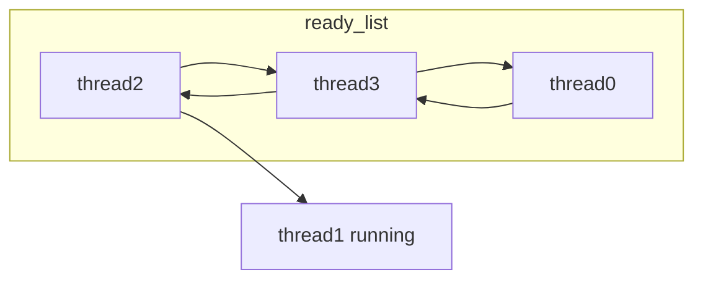
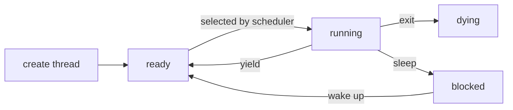
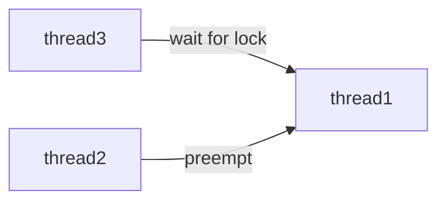
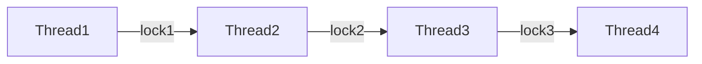
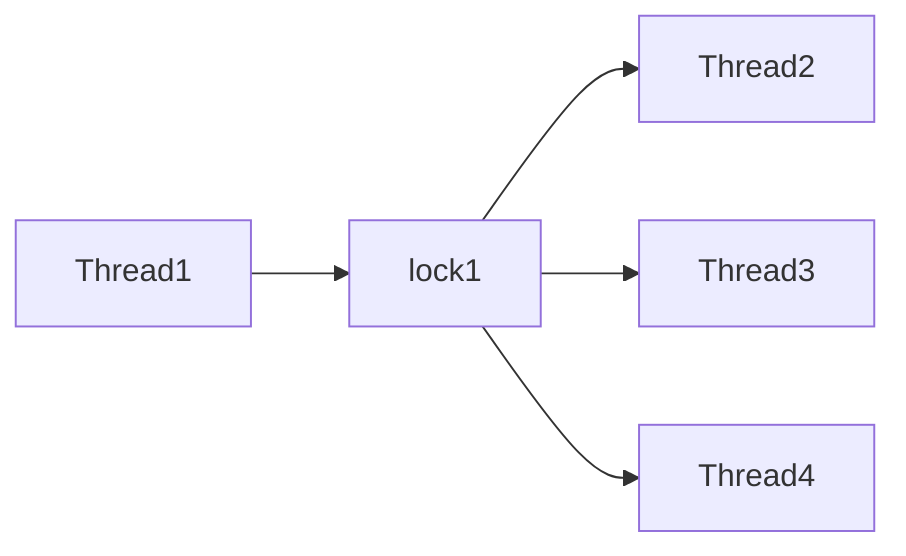
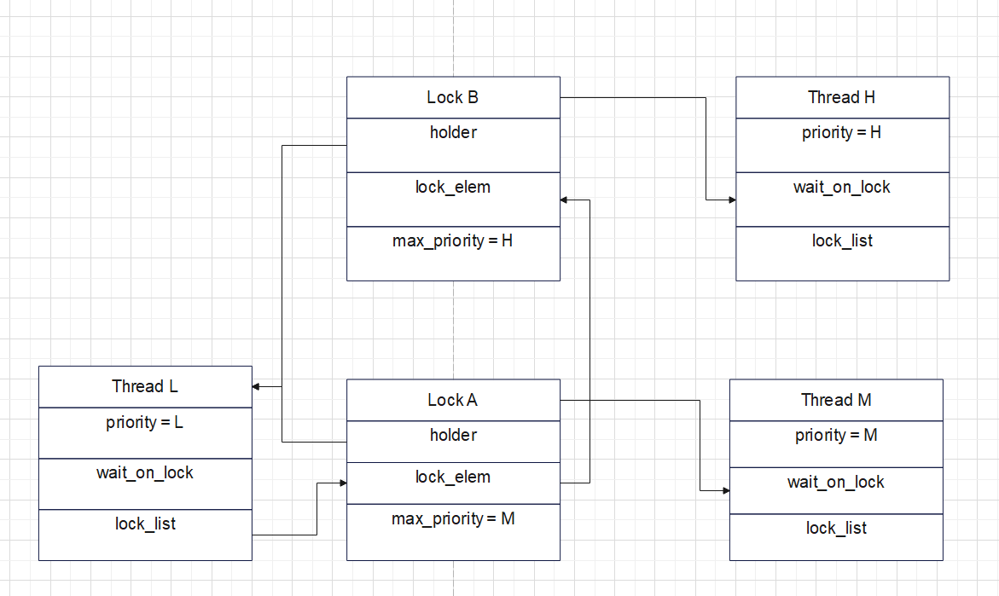
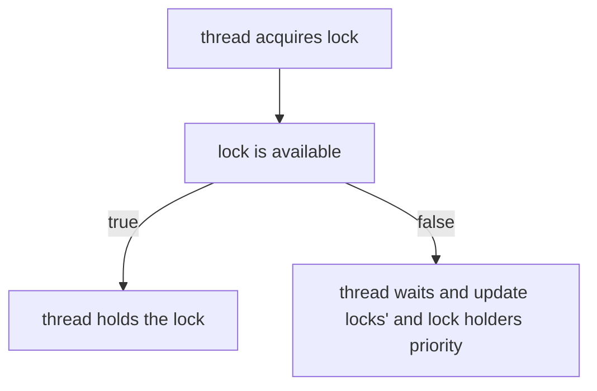
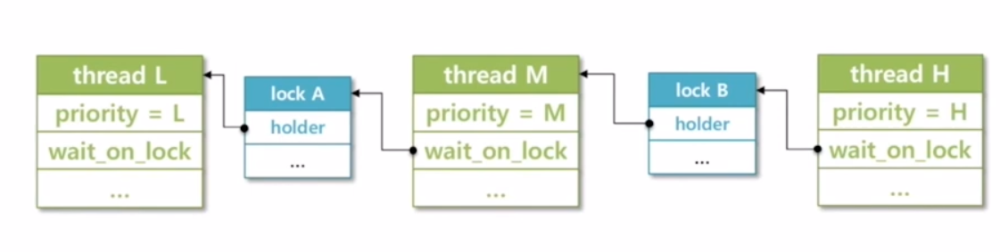
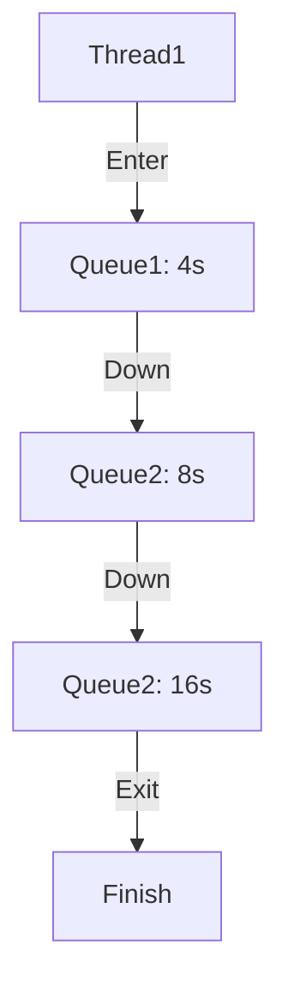

bbb# Project 1: Threads


## Alarm Clock

#### DATA STRUCTURES

>Global tick: Used to track the minimum tick time of all sleeping threads </br>
>Local tick: Time when a sleeping thread can wake up, should greater than or equal to Local tick </br>

The purpose of Global tick is used to improve the efficency of timer interrupt handler. If current tick is less than Glocal tick, that means no sleeping thread need to be wake up, and interrupt handler can return immediately. 
>Sleep list: List of all sleeping threads, should be sorted by thread's sleep time

#### ALGORITHMS

>A2: Briefly describe what happens in a call to timer_sleep()</br>
>including the effects of the timer interrupt handler.

**timer_sleep** should simple call thread_sleep if elapsed time is less than or equal to required sleep time </br>
thread_sleep should turn current thread's state from THREAD_RUNNING into THREAD_BLOCKER and insert it into sleeping list (sorted). </br>
**timer interrupt handler** should determine which thread to wake up everytime when timer interrupt occurs. For the thread to wake up, remove it from the sleeping list and insert it into the ready list.

Busy waiting code:
```
while(elapsed_time < sleep_time) {
    thread_yield();
}
```
Explaination of busy waiting


After calling sleep on thread0, the state of all threads will become like this


On busy waiting implementation, scheduler will select sleeping thread as normal. However, timer_sleep will continue check if current time passes sleep time. If not, current sleeping thread will be put back to the end of the ready list and wait for the time to be wake up. Inserting thread into ready list will cost CPU clocks and that's why this implementation is called busy waiting.


How to avoid bust waiting

Instead of putting thread to the end of the ready list, we can block the sleeping thread and put it to the sleep list.

Thread life cycle:

>A3: What steps are taken to minimize the amount of time spent in
>the timer interrupt handler?

The use of global ticks can minimize the amount of time spent in the timer interrupt handler

#### SYNCHRONIZATION

>A4: How are race conditions avoided when multiple threads call
>timer_sleep() simultaneously?


>A5: How are race conditions avoided when a timer interrupt occurs
>during a call to timer_sleep()?


Interrupt is disabled to avoid race conditions

#### RATIONALE

>A6: Why did you choose this design?  In what ways is it superior to
>another design you considered?


## Priority Scheduling

#### DATA STRUCTURES

>Exercise 2.1 Priority Scheduler</br>

Provided scheduler
```
static void
schedule (void) 
{
  struct thread *cur = running_thread ();
  struct thread *next = next_thread_to_run ();
  struct thread *prev = NULL;

  ASSERT (intr_get_level () == INTR_OFF);
  ASSERT (cur->status != THREAD_RUNNING);
  ASSERT (is_thread (next));

  if (cur != next)
    prev = switch_threads (cur, next);
  thread_schedule_tail (prev);
}

static struct thread *
next_thread_to_run (void) 
{
  if (list_empty (&ready_list))
    return idle_thread;
  else
    return list_entry (list_pop_front (&ready_list), struct thread, elem);
}
```
The provided scheduler simple choose the first thread in ready list. We want to modify it to choose the thread with the highest priority.

To achieve that, we can modify how thread is inserted into ready list when it was created to ensure the ready list is always sorted by priority in descending order. Thus, the first thread in ready list always has the highest priority.


When a thread is created and put to the ready list. It will compare its own priority with the current running thread's priority. If it wins, it will preempt the CPU.


Also, we want to make sure that when threads are waiting for a lock, semaphore, or condition variable, the highest priority waiting thread should be awakened first. 

```
struct semaphore 
  {
    unsigned value;             /**< Current value. */
    struct list waiters;        /**< List of waiting threads. */
  };

struct condition 
  {
    struct list waiters;        /**< List of waiting threads. */
  };
```

To achieve that, we want to make sure the waiter is sorted by thread's priority in descinding order by modifying sema_down and cond_wait

Think about thread's priority change while waiting for the lock. In this case, we also want to make sure the waiter lists is sorted. So sort the waiter list before sema_up and cond_signal is needed.

>Exercise 2.2 Priority Donation </br>

Priority Donation is used to solve Priority Inverse

Priority Inverse Explaination:

Think about 3 thread, thread1 with priority 1, thread2 with p 2, thread3 with p3.

A thread with high priority waits for lock of a thread with low priority, but a thread with medium priority preempts the current running thread. In the end, the thread with highest priority don't have chance to run.

Priority Donation means thread3 will donate its priority to thread1 temporaryly. So thread2 won't be able to preempt thread1.

Nested Donation:



Thread2 waits for lock1 that Thread1 holds, Thread3 waits for lock2 that Thread2 holds, Thread4 waits for lock3 that Thread3 holds. This scenario is called Nested Donation

On Nested Donation, all threads should be donated to the Max priority among all threads

Multiple Donation:


Multiple Threads wait for one lock that Thread1 holds. This scenario is called Multiple Donation

On Multiple Donation, current running threads should be donated to the Max priority among waiting threads.

Multiple Donation Solution:


Each thread will maintain a lock list. Each lock will maintain a max priority field represents the highest priority amoung threads acquiring the lock. When a thread acquire a new lock, that lock will be inserted into lock list in descending order of priority. If the lock's max priority is larger than existing lock's max priority, thread's priority needs to be updated.




Nested Donation Solution: wait_on_lock



When a thread acquire an acquired lock, kernel will use recusion to update all thread's priority on the nested chain.


## Advanced Scheduler

Advanced Scheduler is a 4.4 BSD scheduler MLFQ (Multiple level Feedback Queue) like scheduler without the queues. It give priority to the processes with interactive nature and select processes based on priority. 

The goal of Adcanced Scheduler is to behave the same as MLFQ scheduler. Let's recall MLFQ scheduler behavior. 




Let's say there are 3 queues. Queue1, 2, 3 and Q1's priority > Q2 > Q3.
A new thread will enter the top level priority queue and execute 4 seconds. If it uses up the time quantum, that thread's priority will be decreased and enter the next level queue which has a lower priority and more time quantum. If a thread yields CPU resources, it will stay in the same level queue.

Therefore, an I/O-bound task needing only a modest amount of computing will be scheduled quickly, while Compute-bound tasks run with a long time quantum to minimize switch overhead.

To achieve fairness, kernel will monitor each thread to make sure all threads will get the **Fair Share**. Periodically, any threads receiving less than its fair share will get higher priority; equally, tasks that receive more than their fair share will get lower priority.

>So how to achieve MLFQ behavior?

Nice value[-20, 20]: represents the niceness of a thread. 
If a thread is nicer, it is willing to give up some of its CPU time

>Priority Calculation:

```
priority = PRI_MAX(63) - (recent_cpu / 4) - (nice * 2)
```
Rules
1. If the thread is nicer, lower its priority
2. If the have been using lots of CPU recently, lower the priority
3. For all threads, priority is recalculated once in fourth clock tick
4. The result is truncated to its nearest integer

>CPU usage update
Rules
1. Update the recent_cpu of the current running thread by 1 in every timer interrupt
2. Decay recent_cpu by **decay factor** in every second. In heavy load, decay is nearly 1. In light load, decay is 0
3. Adjust recent_cpu by nice in every second
4. At booting, load_average is initially set to 0.
5. ready_threads is the number of threads in ready list
```
load_average = (59/60) * load_average + (1/60) * ready_threads
decay = (2*load_average) / (2*load_average + 1)
recent_cpu = decay * recent_cpu + nice
```
In summary, we need

1. Update threads' priority in every fourth ticks
2. Increment recent_cpu every tick
3. Update recent_cpu every seconds

