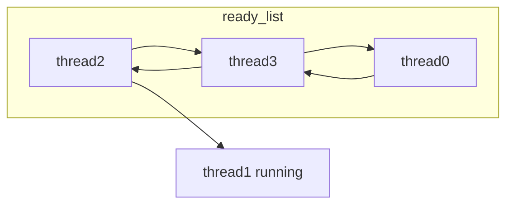
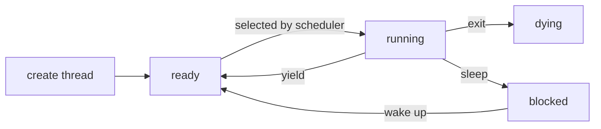

bbb# Project 1: Threads


## Alarm Clock

#### DATA STRUCTURES

>Global tick: Used to track the minimum tick time of all sleeping threads </br>
>Local tick: Time when a sleeping thread can wake up, should greater than or equal to Local tick </br>

The purpose of Global tick is used to improve the efficency of timer interrupt handler. If current tick is less than Glocal tick, that means no sleeping thread need to be wake up, and interrupt handler can return immediately. 
>Sleep list: List of all sleeping threads, should be sorted by thread's sleep time

#### ALGORITHMS

>A2: Briefly describe what happens in a call to timer_sleep()</br>
>including the effects of the timer interrupt handler.

**timer_sleep** should simple call thread_sleep if elapsed time is less than or equal to required sleep time </br>
thread_sleep should turn current thread's state from THREAD_RUNNING into THREAD_BLOCKER and insert it into sleeping list (sorted). </br>
**timer interrupt handler** should determine which thread to wake up everytime when timer interrupt occurs. For the thread to wake up, remove it from the sleeping list and insert it into the ready list.

Busy waiting code:
```
while(elapsed_time < sleep_time) {
    thread_yield();
}
```
Explaination of busy waiting


After calling sleep on thread0, the state of all threads will become like this


On busy waiting implementation, scheduler will select sleeping thread as normal. However, timer_sleep will continue check if current time passes sleep time. If not, current sleeping thread will be put back to the end of the ready list and wait for the time to be wake up. This insertion of thread into ready list will cost CPU clocks and that's why this implementation is called busy waiting.


How to avoid bust waiting

Instead of putting thread to the end of the ready list, we can block the sleeping thread and put it to the sleep list.

Thread life cycle:

>A3: What steps are taken to minimize the amount of time spent in
>the timer interrupt handler?


#### SYNCHRONIZATION

>A4: How are race conditions avoided when multiple threads call
>timer_sleep() simultaneously?


>A5: How are race conditions avoided when a timer interrupt occurs
>during a call to timer_sleep()?


#### RATIONALE

>A6: Why did you choose this design?  In what ways is it superior to
>another design you considered?


## Priority Scheduling

#### DATA STRUCTURES

>B1: Copy here the declaration of each new or changed struct or struct member, global or static variable, typedef, or enumeration.  Identify the purpose of each in 25 words or less.


>B2: Explain the data structure used to track priority donation.
>Use ASCII art to diagram a nested donation.  (Alternately, submit a
>.png file.)


#### ALGORITHMS

>B3: How do you ensure that the highest priority thread waiting for
>a lock, semaphore, or condition variable wakes up first?


>B4: Describe the sequence of events when a call to lock_acquire()
>causes a priority donation.  How is nested donation handled?


>B5: Describe the sequence of events when lock_release() is called
>on a lock that a higher-priority thread is waiting for.


#### SYNCHRONIZATION

>B6: Describe a potential race in thread_set_priority() and explain
>how your implementation avoids it.  Can you use a lock to avoid
>this race?


#### RATIONALE

>B7: Why did you choose this design?  In what ways is it superior to
>another design you considered?


## Advanced Scheduler

#### DATA STRUCTURES

>C1: Copy here the declaration of each new or changed struct or struct member, global or static variable, typedef, or enumeration.  Identify the purpose of each in 25 words or less.


#### ALGORITHMS

>C2: How is the way you divided the cost of scheduling between code
>inside and outside interrupt context likely to affect performance?


#### RATIONALE

>C3: Briefly critique your design, pointing out advantages and
>disadvantages in your design choices.  If you were to have extra
>time to work on this part of the project, how might you choose to
>refine or improve your design?


>C4: The assignment explains arithmetic for fixed-point math in
>detail, but it leaves it open to you to implement it.  Why did you
>decide to implement it the way you did?  If you created an
>abstraction layer for fixed-point math, that is, an abstract data
>type and/or a set of functions or macros to manipulate fixed-point
>numbers, why did you do so?  If not, why not?