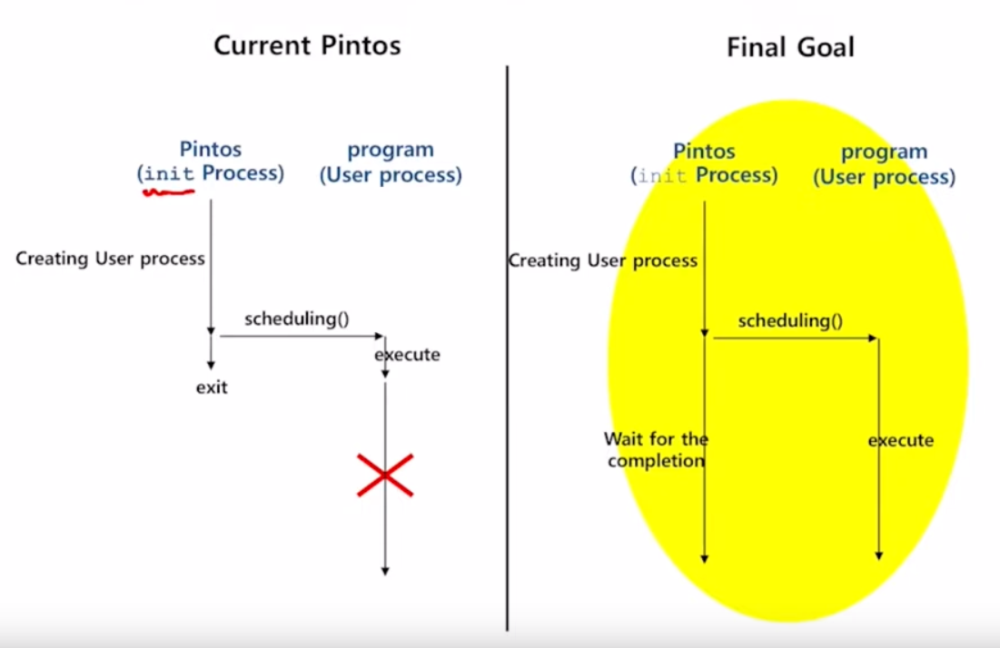
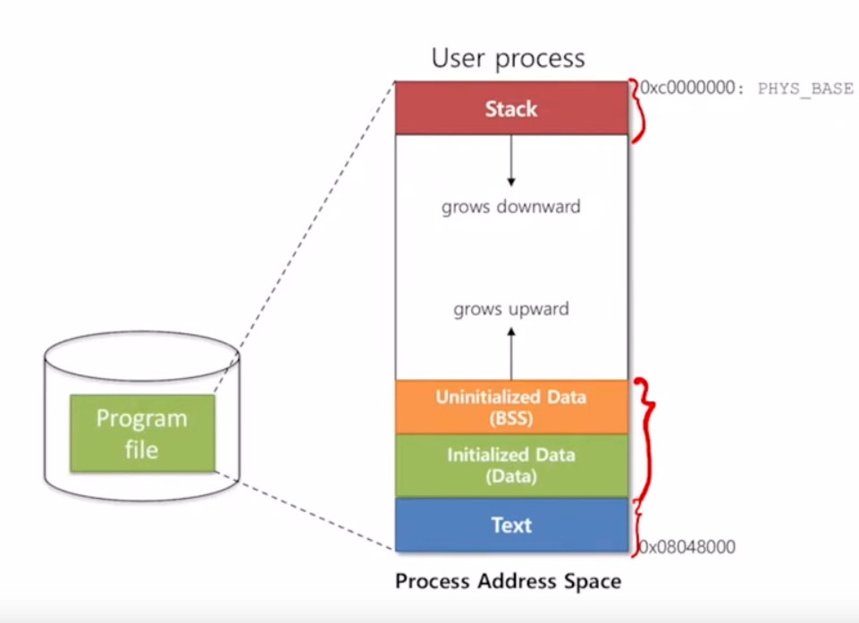
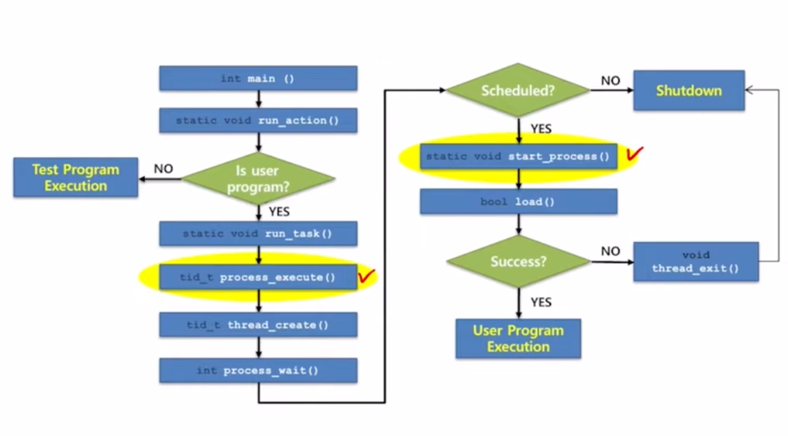
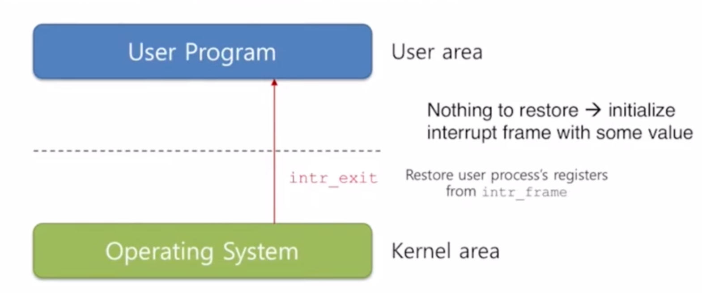

# Project 2: User Programs

This project's goal is to support user program execution on Pintos

# Program Exectution Explaination

## Provided Pintos program execution
```
init.c: run_task
/** Runs the task specified in ARGV[1]. */
static void
run_task (char **argv)
{
  const char *task = argv[1];
  
  printf ("Executing '%s':\n", task);
#ifdef USERPROG
  process_wait (process_execute (task));
#else
  run_test (task);
#endif
  printf ("Execution of '%s' complete.\n", task);
}
```
```
process.c: process_wait
/** Waits for thread TID to die and returns its exit status.  If
   it was terminated by the kernel (i.e. killed due to an
   exception), returns -1.  If TID is invalid or if it was not a
   child of the calling process, or if process_wait() has already
   been successfully called for the given TID, returns -1
   immediately, without waiting.

   This function will be implemented in problem 2-2.  For now, it
   does nothing. */
int
process_wait (tid_t child_tid UNUSED) 
{
  return -1;
}
```
Pintos will call process_wait(process_execute(task)) to execute specific task. However, process_wait is not implemented. Therefore, OS thread will not waits for child thread to finish. Our goal is to force Pintos process waits for user process to finish.

## Execute a program
```
/** Starts a new thread running a user program loaded from
   FILENAME.  The new thread may be scheduled (and may even exit)
   before process_execute() returns.  Returns the new process's
   thread id, or TID_ERROR if the thread cannot be created. */
tid_t
process_execute (const char *file_name) 
{
  char *fn_copy;
  tid_t tid;

  /* Make a copy of FILE_NAME.
     Otherwise there's a race between the caller and load(). */
  fn_copy = palloc_get_page (0);
  if (fn_copy == NULL)
    return TID_ERROR;
  strlcpy (fn_copy, file_name, PGSIZE);

  /* Create a new thread to execute FILE_NAME. */
  tid = thread_create (file_name, PRI_DEFAULT, start_process, fn_copy);
  if (tid == TID_ERROR)
    palloc_free_page (fn_copy); 
  return tid;
}
```

Pintos process will create a new thread with **file_name** to run user program



## Create a thread
thread_create()
1. Create "struct thread" and initialize it
2. Allocate the kernel stack
3. Register the function to run: start_process
4. Add it to the ready list

## Starting a process
```
/** A thread function that loads a user process and starts it
   running. */
static void
start_process (void *file_name_)
{
  char *file_name = file_name_;
  struct intr_frame if_;
  bool success;

  /* Initialize interrupt frame and load executable. */
  memset (&if_, 0, sizeof if_);
  if_.gs = if_.fs = if_.es = if_.ds = if_.ss = SEL_UDSEG;
  if_.cs = SEL_UCSEG;
  if_.eflags = FLAG_IF | FLAG_MBS;
  success = load (file_name, &if_.eip, &if_.esp);

  /* If load failed, quit. */
  palloc_free_page (file_name);
  if (!success) 
    thread_exit ();

  /* Start the user process by simulating a return from an
     interrupt, implemented by intr_exit (in
     threads/intr-stubs.S).  Because intr_exit takes all of its
     arguments on the stack in the form of a `struct intr_frame',
     we just point the stack pointer (%esp) to our stack frame
     and jump to it. */
  asm volatile ("movl %0, %%esp; jmp intr_exit" : : "g" (&if_) : "memory");
  NOT_REACHED ();
}
```
start_process needs to load binary file into memory. If load is successful, the process continues to execute. If it fails, process will exit.

## Load a program
Load a ELF (Executable and Linkable Format)
1. Create page table
2. Open the file, read the ELF header
3. Parse the file, load the 'data' to the data segment
4. Create user stack and initialize it

## After loading
After loading, program's data will be written into memory. Each section will be assigned into designated place in its own address space



This is the whole program execution workflow

# Tasks
## Argument Passing

For file_name = "echo x y z"

Provided process_execute will directly pass the whole file_name to thread. In the end, we will get a thread named with "echo x y z", arguments "x y z" are not passes

The goal of this task is to parse the file_name to get actually file_name and arguments. The actual file_name will be passed to thread and arguments will be pushed to user stack.

### Functions to modify

process_execute and start_process needs to be modified

process_execute needs to parse the string of file_name and forward first token as name of new process to thread_create() function

start_process needs to parse file_name and save tokens on user stack of new process

### Save arguments on user stack

start_process will do the following
1. Allocate interrupt frame
2. Load program and initialize interrupt frame and user stack
3. Setup arguments at the user stack
4. Jump to the user program through interrrupt_exit

#### DATA STRUCTURES

>A1: Copy here the declaration of each new or changed struct or struct member, global or static variable, typedef, or enumeration.  Identify the purpose of each in 25 words or less.


#### ALGORITHMS

>A2: Briefly describe how you implemented argument parsing.  How do you arrange for the elements of argv[] to be in the right order?
>How do you avoid overflowing the stack page?


#### RATIONALE

>A3: Why does Pintos implement strtok_r() but not strtok()?


>A4: In Pintos, the kernel separates commands into a executable name and arguments.  In Unix-like systems, the shell does this separation.  Identify at least two advantages of the Unix approach.


## System Calls

#### DATA STRUCTURES

>B1: Copy here the declaration of each new or changed struct or struct member, global or static variable, typedef, or enumeration.  Identify the purpose of each in 25 words or less.


>B2: Describe how file descriptors are associated with open files. Are file descriptors unique within the entire OS or just within a single process?


#### ALGORITHMS

>B3: Describe your code for reading and writing user data from the kernel.


>B4: Suppose a system call causes a full page (4,096 bytes) of data
>to be copied from user space into the kernel.  What is the least
>and the greatest possible number of inspections of the page table
>(e.g. calls to pagedir_get_page()) that might result?  What about
>for a system call that only copies 2 bytes of data?  Is there room
>for improvement in these numbers, and how much?


>B5: Briefly describe your implementation of the "wait" system call
>and how it interacts with process termination.


>B6: Any access to user program memory at a user-specified address
>can fail due to a bad pointer value.  Such accesses must cause the
>process to be terminated.  System calls are fraught with such
>accesses, e.g. a "write" system call requires reading the system
>call number from the user stack, then each of the call's three
>arguments, then an arbitrary amount of user memory, and any of
>these can fail at any point.  This poses a design and
>error-handling problem: how do you best avoid obscuring the primary
>function of code in a morass of error-handling?  Furthermore, when
>an error is detected, how do you ensure that all temporarily
>allocated resources (locks, buffers, etc.) are freed?  In a few
>paragraphs, describe the strategy or strategies you adopted for
>managing these issues.  Give an example.


#### SYNCHRONIZATION

>B7: The "exec" system call returns -1 if loading the new executable
>fails, so it cannot return before the new executable has completed
>loading.  How does your code ensure this?  How is the load
>success/failure status passed back to the thread that calls "exec"?


>B8: Consider parent process P with child process C.  How do you
>ensure proper synchronization and avoid race conditions when P
>calls wait(C) before C exits?  After C exits?  How do you ensure
>that all resources are freed in each case?  How about when P
>terminates without waiting, before C exits?  After C exits?  Are
>there any special cases?


#### RATIONALE

>B9: Why did you choose to implement access to user memory from the
>kernel in the way that you did?


>B10: What advantages or disadvantages can you see to your design
>for file descriptors?


>B11: The default tid_t to pid_t mapping is the identity mapping.
>If you changed it, what advantages are there to your approach?